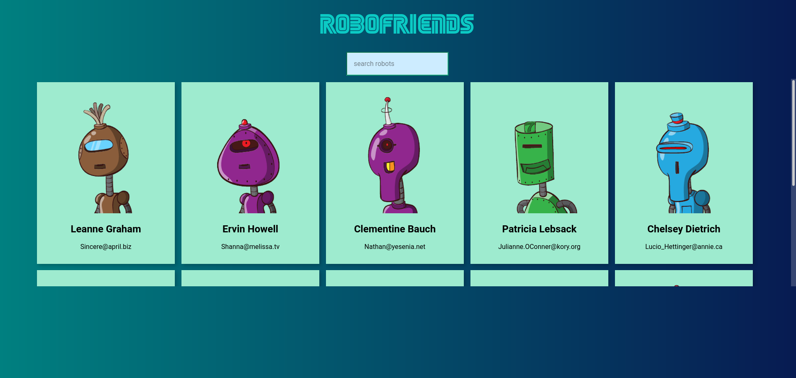

<div align="center">
  
</div>
<h1 align="center">
  Friend Finder
</h1>
<p align="center">
 Front-end Friend Finder web-app built using ReactJS, Redux & Tachyons along with various middlewares to facilitate better working.
</p>
<br>


# 📚 Libraries Used

```bash
React
React-Redux (State Management) 
React-Strap
Bootstrap
Redux-thunk & Redux-logger(Middlewares)
npm
Babel
```

## 🛠 Installation & Set Up

1. Clone the frontend repository.

   ```bash
   git clone https://github.com/Abhishekjindal09/Friend_Finder.git
   ```

2. Install dependencies

   ```bash
   npm install
   ```

3. Start the development server

   ```bash
   npm start
   ```
